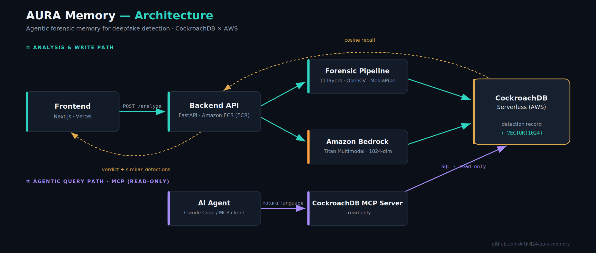
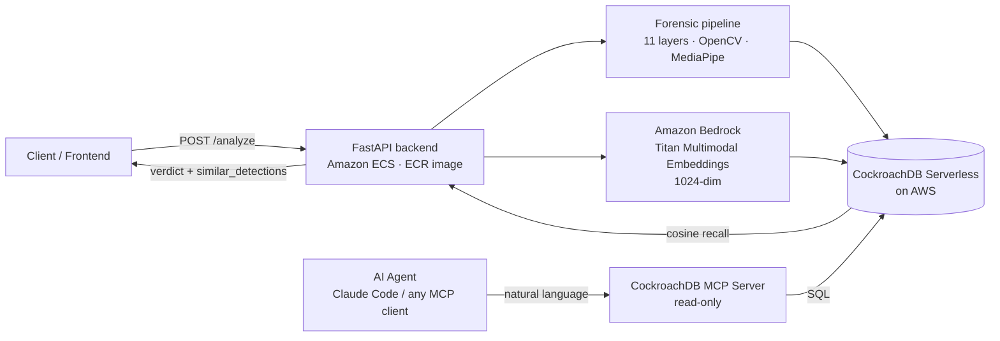

# 🧠 AURA Memory

> **Agentic forensic memory for deepfake detection.** Every analysis is remembered as a vector, recalled by similarity, and queryable in plain language.

Built for the **CockroachDB × AWS Hackathon 2026** — _Build with agentic memory._

🎥 **[Watch the 60-second demo](https://youtu.be/qr692pi1Ds8)** · 📂 **[Source code](https://github.com/Artkill24/aura-memory)**

---

## The problem

Deepfake detectors are **stateless**. Every video is judged in isolation; the moment the response is returned, the evidence is gone. There is no institutional memory — no way to ask _"have we seen this manipulation before?"_ or _"which files came back with conflicting signals last week?"_

**AURA Memory** turns a one-shot detector into a system that remembers.

## What it does

- 🔬 **Analyzes** a video through AURA's multi-layer forensic pipeline and returns a verdict (`SUSPICIOUS`, `CONFLICTING SIGNALS`, `AUTHENTIC`, …) with a composite score. Layer 10 even identifies the likely generative origin (Sora / Kling / Veo).
- 🧬 **Remembers** every analysis: a durable detection record **plus a multimodal vector embedding** is written to CockroachDB.
- 🔁 **Recalls** similar past detections via cosine similarity — the _"seen before"_ signal is returned inline with every new analysis.
- 🤖 **Answers questions** about its own memory in natural language via the **Model Context Protocol (MCP)** — an AI agent turns _"how many detections and with which verdicts?"_ into SQL, runs it over a locked-down read-only connection, and answers.

## Architecture



Frontend: **Next.js on Vercel**. Backend: **Docker image on Amazon ECR**, running on **Amazon ECS (Express Mode)**. State + memory: **CockroachDB Serverless on AWS**.

<details>
<summary>Mermaid source</summary>



</details>

## Tech stack

| Layer | Technology |
|---|---|
| Forensic detection | Python · FastAPI · OpenCV · MediaPipe · Transformers (11-layer pipeline) |
| Embeddings | Amazon Bedrock — Titan Multimodal (1024-dim) |
| Memory / vector store | CockroachDB Serverless (AWS) — `VECTOR` column, cosine similarity |
| API | FastAPI + OpenAPI / Swagger (`/docs`) |
| Agentic memory | Model Context Protocol — CockroachDB MCP server (read-only) |
| Frontend | Next.js on Vercel |
| Compute | Amazon ECS (Express Mode), image on ECR; AWS Lambda for ingestion |

## How the memory works

Each analysis produces a **fixed-size 1024-dimensional embedding** from Amazon Bedrock's Titan Multimodal model. Because the embedding is fixed-size, a 5-second clip and a 2-hour film cost the **same** storage — the video itself never enters the database, only its mathematical fingerprint. Raw files live in S3.

Detections are stored in a single table (simplified):

```sql
CREATE TABLE detections (
    id              UUID PRIMARY KEY DEFAULT gen_random_uuid(),
    filename        STRING,
    verdict         STRING,          -- SUSPICIOUS | CONFLICTING SIGNALS | AUTHENTIC ...
    status          STRING,          -- done | processing | error
    composite_score FLOAT,
    embedding       VECTOR(1024),    -- Titan Multimodal fingerprint
    pdf_url         STRING,          -- forensic report (S3)
    created_at      TIMESTAMPTZ DEFAULT now()
);
```

Recall is a nearest-neighbour query over the vector column:

```sql
SELECT filename, verdict, embedding <-> $1 AS distance
FROM detections
ORDER BY distance
LIMIT 5;
```

A distance near `0` means _we have analyzed something almost identical before_ — surfaced as `similar_detections` in the `/analyze` response.

## Agentic memory via MCP ⭐

This is the heart of the _agentic memory_ theme. The detection memory is exposed to any MCP-compatible AI client (Claude Code, Cursor, …) through the **CockroachDB MCP server**. Questions in natural language become SQL against the live database:

> **"How many detections are there and with which verdicts?"**
> → `SELECT verdict, count(*) FROM detections GROUP BY verdict`
>
> **"Show me the last detection with its verdict and time."**
>
> **"Are there any detections with conflicting signals? Which files?"**

The agent writes the query, runs it, and even self-corrects — for example, excluding the large `embedding` column when it is not needed.

## Security model

Two independent, demonstrable layers protect the memory:

1. **Least-privilege database user** — a dedicated `aura_readonly` SQL user with `GRANT SELECT` on the detections table only. It cannot write, alter, or drop anything.
2. **Read-only MCP server** — the CockroachDB MCP server runs with `--read-only`, gating every write-shaped tool at the protocol layer.

All connections are encrypted in transit (`sslmode=require`).

> _Even if the agent were compromised or prompted maliciously, it is structurally unable to modify the memory._

## API

`POST /analyze` — multipart upload (`file=@video.mp4`) →

```json
{
  "verdict": "SUSPICIOUS",
  "composite_score": 0.396,
  "status": "done",
  "similar_detections": [
    { "filename": "…", "verdict": "…", "distance": 0.02 }
  ]
}
```

Interactive docs: **`/docs`** (Swagger UI).

## Getting started

```bash
git clone https://github.com/Artkill24/aura-memory.git
cd aura-memory
cp .env.example .env        # then fill in your values
pip install -r requirements.txt
uvicorn app.main:app --reload   # adjust to your actual entrypoint
```

### Connect the MCP server (read-only)

```bash
claude mcp add cockroachdb -- uvx --from git+https://github.com/amineelkouhen/mcp-cockroachdb.git \
  cockroachdb-mcp-server --read-only \
  --url "postgresql://aura_readonly:***@<host>:26257/defaultdb?sslmode=require"
```

Then ask your MCP client: _"How many detections are there and with which verdicts?"_

## Roadmap / hardening

- [ ] Bake the CockroachDB CA cert into the image to enable `sslmode=verify-full`
- [ ] Rotate the `aura_readonly` credential and load it from a secrets manager
- [ ] Batch-ingest a labelled deepfake/authentic corpus to enrich recall
- [ ] Expose recall thresholds via the API

## Hackathon

Built for the **CockroachDB × AWS Hackathon 2026** — _Build with agentic memory_.
Submission deadline: **18 Aug 2026**.

🎥 [Demo video](https://youtu.be/qr692pi1Ds8)

---

Part of the **AURA** deepfake-detection project · [ARTKILL24](https://github.com/Artkill24)
